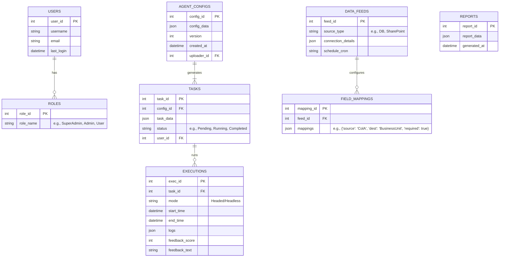
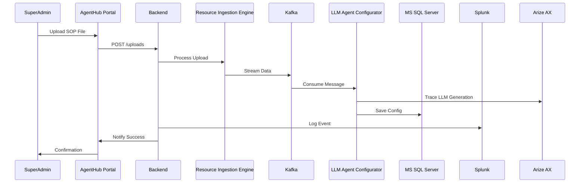
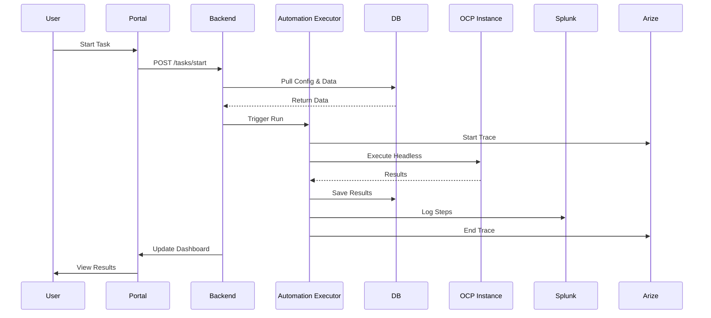

# AutoAgent Enterprise: Comprehensive Functional Design Document

## 1. Document Metadata

- **Document Title:** AutoAgent Enterprise Functional Design Document
- **Version:** 1.3 (Updated as of December 14, 2025)
- **Authors:** Sunil Anikepati – Based on user specifications and best practices for enterprise SaaS design.
- **Purpose:** This document provides a full, end-to-end functional and architectural blueprint for the AutoAgent Enterprise SaaS product. It includes detailed functional requirements, use cases, non-functional aspects, system architecture with multiple diagrams (using Mermaid for visualizations), data models, API specifications, integration details, security and compliance considerations, deployment strategies, testing plans, risk assessment, glossary, and appendices. Updates incorporate PingFederate for SSO, Microsoft SQL Server for the database, Arize AX for observability, and Splunk for logging. This version expands significantly for new development, adding extensive documentation and additional diagrams to support implementation and maintenance.

## 2. Product Overview

**Product Name:** AutoAgent Enterprise

AutoAgent Enterprise is an enterprise-grade SaaS platform for browser automation using AI agents built with Google's Agent Development Kit (ADK) and LLM capabilities. It enables automation of web-based tasks (e.g., data entry, navigation, form submissions) by ingesting instructional resources (videos, audio, click streams) to generate agent configurations. The platform supports data integration from various sources, scheduled/on-demand executions in headed (human-in-the-loop) or headless modes, task monitoring with feedback loops, and reporting. It emphasizes security, scalability, and role-based workflows for super admins, admins, and users.

**Key Objectives:**
- Automate repetitive browser tasks to improve efficiency.
- Provide configurable data pipelines for enterprise integrations.
- Ensure auditability and human oversight for compliance-sensitive operations.
- Scale seamlessly for enterprise workloads.
- Incorporate advanced observability with Arize AX for monitoring LLM agents and application performance.
- Use Splunk for centralized logging and analysis.

**Scope and Boundaries:**
- In Scope: Web-based automation, data ingestion, agent execution, monitoring, reporting.
- Out of Scope: Mobile app development, on-premises deployment (cloud-first), custom LLM training (uses pre-built ADK/Gemini).

**Assumptions and Constraints:**
- Built on open-source tools where possible, with commercial options like PingFederate for SSO, MS SQL Server for the database, Arize AX for observability, and Splunk for logs.
- No real-time video processing assumed; ingestion focuses on extraction for config generation.
- Compliance with standards like GDPR, SOC 2 (to be implemented in later phases).
- Development assumes a team familiar with JavaScript/Python, containerization, and AI integrations.

**High-Level Roadmap:**
- Phase 1: MVP with core ingestion and execution (Q1 2026).
- Phase 2: Advanced integrations and observability (Q2 2026).
- Phase 3: Scaling and enterprise features (Q3 2026).

## 3. Functional Requirements

### 3.1 Core Modules
- **Resource Management Module:** Handles upload, processing, and versioning of SOP resources by super admins.
- **Configuration Module:** Generates, validates, and stores ADK LLM agent configs.
- **Data Integration Module:** Configures, maps, and ingests data feeds from multiple sources.
- **Execution Module:** Schedules, triggers, and runs agents in different modes.
- **Monitoring and Feedback Module:** Displays results, collects user feedback, and manages reruns.
- **Reporting Module:** Generates customizable analytics and exports.
- **User Management Module:** Manages roles, profiles, and authentication via PingFederate SSO.
- **Observability Module:** Integrates Arize AX for AI-specific monitoring (e.g., agent traces, performance metrics).
- **Logging Module:** Uses Splunk for log aggregation, searching, and alerting.

### 3.2 Detailed Functional Specs
- **FR-1: Resource Ingestion**
  - Super admins upload videos (.mp4), audio (.mp3), or click streams (.json) via the web portal (file size limit: 500MB).
  - System processes uploads asynchronously: Extract steps using LLM (e.g., transcription with Whisper-like models, analysis via Gemini).
  - Generate ADK LLM agent configs (e.g., JSON with steps: { "action": "navigate", "url": "example.com" }, { "action": "click", "selector": "#button" }).
  - Store configs in MS SQL Server with metadata (version, timestamp, uploader).
  - Log ingestion events to Splunk; trace LLM extraction with Arize AX for drift detection.

- **FR-2: Data Integration and Mapping**
  - Admins configure integrators using Apache NiFi flows for sources: MS SQL queries, SharePoint Excel via Microsoft Graph API, manual CSV/JSON uploads, REST API pushes.
  - UI: React-based drag-and-drop for field mapping (e.g., source: "ColumnA" → destination: "BusinessUnit"; required: true; data type: string).
  - Validation: Real-time checks for completeness; preview sample data.
  - Store mappings as JSON in DB.
  - Log changes to Splunk.

- **FR-3: Scheduling and Triggers**
  - Admins define schedules via cron UI (e.g., "*/30 * * * *" for every 30 minutes) or triggers (webhooks on data arrival).
  - System uses Quartz Scheduler or similar for job management.
  - Check data readiness via polling or events.
  - Monitor adherence with Arize AX metrics.

- **FR-4: Agent Execution**
  - Pull config and data from DB on trigger.
  - Execute via Playwright/Puppeteer: Headed mode on cloud VMs (e.g., AWS EC2 with VNC for human monitoring); Headless on OCP pods.
  - Handle errors gracefully (e.g., retry on transient failures).
  - Log steps to Splunk; trace agent decisions with Arize AX (e.g., LLM prompt/response pairs).

- **FR-5: Dashboard and Feedback**
  - Real-time dashboard (React + WebSockets) showing task status, logs, and metrics.
  - Feedback form: Text area, rating (1-5), attachments.
  - Rerun: Update data via form, set flag; queue for next execution.
  - Integrate Arize AX widgets for live traces.

- **FR-6: Reporting**
  - Custom reports via UI builder (filters, columns).
  - Metrics: Success rate (%), avg. execution time (ms), feedback score avg.
  - Exports: CSV, PDF (via jsPDF), Excel (xlsxwriter).
  - Pull insights from Arize AX (e.g., anomaly alerts) and Splunk (e.g., error trends).

- **FR-7: Authentication and Authorization**
  - PingFederate SSO: SAML 2.0 for login; attribute mapping for roles (e.g., groups claim).
  - RBAC: Fine-grained permissions (e.g., super admin: all; admin: configs; user: execute/view).
  - Session management: JWT with refresh tokens.
  - Log auth events to Splunk.

- **FR-8: Observability and Logging**
  - Arize AX: Instrument agents for traces (e.g., via SDK: arize.trace(prompt, response)); monitor metrics like token usage, accuracy.
  - Splunk: Forward logs from all services (e.g., via Splunk Forwarder); dashboards for error rates, user activity.
  - Alerts: Email/Slack on thresholds (e.g., >10% failure rate).

## 4. Non-Functional Requirements

- **Performance:** <500ms API latency; support 1,000 daily executions. Benchmark with LoadRunner.
- **Scalability:** Auto-scale pods via OCP; handle 10x growth without downtime.
- **Availability:** 99.95% SLA; multi-AZ deployment.
- **Reliability:** Fault-tolerant Kafka; DB replication.
- **Security:** OWASP Top 10 compliance; regular pentests.
- **Usability:** WCAG 2.1 AA accessible; multi-language support (English default).
- **Maintainability:** Code coverage >80%; automated tests.
- **Compatibility:** Modern browsers; API versioned (v1).
- **Cost Efficiency:** Optimize cloud usage (e.g., spot instances for headless).

## 5. Use Cases

### 5.1 Use Case: Super Admin Uploads SOP
- **Actors:** Super Admin
- **Preconditions:** Authenticated via PingFederate.
- **Steps:**
  1. Login to AgentHub Portal.
  2. Navigate to "Resources" > "Upload SOP".
  3. Select file, add metadata (name, description).
  4. Submit; system queues for ingestion.
  5. Kafka streams to Configurator; generates config.
  6. Store in DB; notify via email.
  7. Log to Splunk; trace in Arize AX.
- **Postconditions:** Config ready; dashboard updated.
- **Exceptions:** Invalid file → Error, retry upload.
- **Variants:** Bulk upload.

### 5.2 Use Case: Admin Configures Data Feed
- **Actors:** Admin
- **Steps:**
  1. Navigate to "Integrations" > "New Feed".
  2. Select source (e.g., SharePoint).
  3. Enter credentials (OAuth via PingFederate).
  4. Load sample data; map fields.
  5. Set schedule/trigger.
  6. Save; validate mappings.
  7. Log to Splunk.
- **Postconditions:** Feed active.

### 5.3 Use Case: User Initiates and Reviews Task
- **Actors:** User
- **Steps:**
  1. Login; go to "Tasks" > "New".
  2. Select agent config; upload data or choose feed.
  3. Start (on-demand) or schedule.
  4. Monitor progress on dashboard.
  5. View results; provide feedback.
  6. If needed, update data and rerun.
  7. View Arize AX traces for details.
- **Postconditions:** Task completed; logs in Splunk.

### 5.4 Use Case: Reporting
- **Actors:** Admin/User
- **Steps:**
  1. Go to "Reports" > "Generate".
  2. Select template (e.g., Task Summary).
  3. Apply filters.
  4. View preview; export.
  5. Integrate Splunk queries for advanced logs.

### 5.5 Use Case: Monitoring and Debugging
- **Actors:** Admin/Super Admin
- **Steps:**
  1. Access "Observability" dashboard.
  2. View Arize AX traces (e.g., agent run timeline).
  3. Query Splunk for logs (e.g., "error* execution").
  4. Set alerts (e.g., high latency).
  5. Debug issues; update configs.

### 5.6 Additional Use Cases
- **Audit Review:** Super admin queries Splunk for user actions.
- **Scale Test:** System auto-scales during peak loads.
- **Failure Recovery:** Rerun failed tasks from dashboard.

## 6. System Architecture

### 6.1 High-Level Overview
Microservices architecture with event-driven flows, containerized on OCP, centralized DB, and external integrations for SSO, observability, and logging.

### 6.2 Mermaid System Design Diagram (Component Flowchart)
```mermaid
flowchart TD
    A[User/Admin/Super Admin] -->|SSO Login| B[PingFederate]
    B -->|Authenticated| C["AgentHub Portal (Next.js)"]

    subgraph "Frontend"
    C
    end

    C -->|API Calls| D["Backend Services (Node.js/FastAPI)"]

    subgraph "Backend"
    D
    end

    subgraph "Ingestion & Config"
    E[Resource Ingestion Engine] -->|Stream| F[Kafka Broker]
    F --> G["LLM Agent Configurator (ADK + Gemini)"]
    G --> H[Central DB (MS SQL Server)]
    end

    D -->|Uploads| E

    subgraph "Data Integration"
    I[Data Integration Hub (Apache NiFi)] -->|Feeds| H
    end

    D -->|Configs| I

    subgraph "Execution"
    J[Automation Executor] -->|Headed| K["Cloud PC Runner (Human-in-Loop)"]
    J -->|Headless| L["OCP Instance (OpenShift)"]
    J -->|Results| H
    end

    H -->|Pull Config/Data| J
    D -->|Triggers| J

    subgraph "Monitoring & Analytics"
    M[Task Monitoring Console] <--|Query| H
    N[Performance Analytics Module] <--|Query| H
    O[Arize AX (Observability)] <--|Traces/Metrics| D
    O <--|Traces/Metrics| G
    O <--|Traces/Metrics| J
    P[Splunk (Logs)] <--|Logs| D
    P <--|Logs| E
    P <--|Logs| G
    P <--|Logs| I
    P <--|Logs| J
    end

    C -->|Display| M
    C -->|Reports| N
    C -->|View Observability| O

    subgraph "External Integrations"
    Q[Data Sources: MS SQL, SharePoint, APIs]
    Q --> I
    end
```

### 6.3 Mermaid Entity Relationship Diagram (ERD)


### 6.4 Mermaid Sequence Diagram: Resource Ingestion Flow


### 6.5 Mermaid Sequence Diagram: Agent Execution Flow


### 6.6 Deployment Diagram (Text-Based)
- **Cloud Provider:** GCP/AWS/Azure (hybrid possible).
- **Frontend:** Deployed on Vercel/Netlify; CDN for assets.
- **Backend Services:** Kubernetes on OCP; services as pods.
- **DB:** MS SQL Server Managed Instance.
- **Kafka:** Managed cluster (Confluent or self-hosted).
- **External:** PingFederate server; Arize AX cloud; Splunk Enterprise/Cloud.

## 7. Data Models

- **Users Table:** user_id (PK), username, email, role_id (FK), password_hash (if fallback), last_login.
- **Agent_Configs Table:** config_id (PK), json_config (nvarchar(max)), version, created_at, uploader_id (FK).
- **Data_Feeds Table:** feed_id (PK), source_type, connection_json, schedule, active (bit).
- **Field_Mappings Table:** mapping_id (PK), feed_id (FK), mappings_json.
- **Tasks Table:** task_id (PK), config_id (FK), data_json, status, user_id (FK), created_at.
- **Executions Table:** exec_id (PK), task_id (FK), mode, start_time, end_time, results_json, feedback_score, feedback_text.
- **Logs View:** Virtual view querying Splunk via API for integrated display.
- **Indexes:** On frequently queried fields (e.g., task_id, created_at).

## 8. API Specifications

### 8.1 API Design Principles
- RESTful with JSON payloads.
- Versioned: /api/v1/.
- Auth: Bearer JWT from PingFederate.
- Rate Limiting: 100 req/min per user.
- Error Handling: Standard HTTP codes; JSON { "error": "message" }.

### 8.2 Key Endpoints
- **POST /api/v1/uploads/sop:** Upload resource; req: multipart/form-data; res: { "config_id": 123 }.
- **POST /api/v1/integrations/feeds:** Create feed; req: { "source": "SharePoint", "mappings": [...] }; res: { "feed_id": 456 }.
- **POST /api/v1/tasks/start:** Initiate task; req: { "config_id": 123, "data": {} }; res: { "task_id": 789 }.
- **GET /api/v1/tasks/{id}/status:** Get status; res: { "status": "Completed", "results": {} }.
- **PUT /api/v1/tasks/{id}/feedback:** Submit feedback; req: { "score": 4, "text": "Good" }.
- **GET /api/v1/reports/generate:** Generate report; query params: type=summary, filters=date_range.
- **GET /api/v1/observability/traces:** Fetch Arize AX traces; res: array of traces.

### 8.3 OpenAPI/Swagger
(Generate via tools like Swagger UI; include in repo.)

## 9. Integration Details

- **PingFederate SSO:** Configure as Service Provider (SP); metadata exchange; attribute release for roles.
- **MS SQL Server:** Use Entity Framework or pyodbc for connections; stored procs for complex queries.
- **Arize AX:** Install SDK (pip install arize); wrap LLM calls: @arize.trace; dashboards for agents.
- **Splunk:** Use HEC for log forwarding; custom indexes (e.g., autoagent_logs); SPL queries for alerts.
- **Apache NiFi:** Flows for data pulls; processors for DB, HTTP, Excel parsing.
- **ADK/Gemini:** Use Google Cloud SDK; API keys secured in vaults.
- **OCP:** Deploy YAML manifests; operators for monitoring.

## 10. Security and Compliance Considerations

- **Authentication:** PingFederate with MFA; token expiration 1h.
- **Authorization:** ABAC via policies (e.g., if role=admin and resource=feed).
- **Data Protection:** Encrypt columns (Always Encrypted); PII masking in logs.
- **Vulnerability Management:** SAST/DAST scans; dependency checks.
- **Compliance:** GDPR (consent for data); SOC 2 (controls for availability/security).
- **Incident Response:** Alerts via Splunk/Arize; playbook for breaches.

## 11. Deployment and Scaling

- **Environments:** Dev, Staging, Prod.
- **CI/CD:** GitHub Actions; build Docker images, deploy to OCP.
- **Scaling:** HPA for pods; DB read replicas.
- **Monitoring:** Arize for AI, Splunk for ops, Prometheus for infra.
- **Backup:** Daily DB snapshots; Kafka topics replicated.

## 12. Testing Plans

- **Unit Tests:** Jest for frontend, Pytest for backend (80% coverage).
- **Integration Tests:** Postman collections for APIs; NiFi flow tests.
- **E2E Tests:** Cypress for UI flows; simulate agent runs.
- **Load Tests:** JMeter for 100 users.
- **Security Tests:** Burp Suite for vulns.
- **Observability Tests:** Validate Arize traces, Splunk queries.

## 13. Risk Assessment

- **High Risks:** LLM inaccuracies (mitigate: human-in-loop, Arize monitoring); Data breaches (mitigate: encryption, audits).
- **Medium Risks:** Integration failures (mitigate: retries, fallbacks); Scalability limits (mitigate: auto-scaling).
- **Low Risks:** UI bugs (mitigate: testing).

## 14. Glossary

- **ADK:** Agent Development Kit (Google's framework for LLM agents).
- **LLM:** Large Language Model (e.g., Gemini).
- **SOP:** Standard Operating Procedure (resources for configs).
- **OCP:** OpenShift Container Platform.
- **RBAC:** Role-Based Access Control.
- **SSO:** Single Sign-On.

## 15. Appendices

- **Appendix A: References** – Google ADK Docs, Arize AX Guides, Splunk Best Practices.
- **Appendix B: Change Log** – v1.0: Initial; v1.1: SSO/DB updates; v1.2: Observability/Logging; v1.3: Expanded docs/diagrams.
- **Appendix C: Sample Config JSON** – { "steps": [{ "type": "click", "target": "button.submit" }] }.

This document serves as the complete blueprint for development. For code samples or further expansions, provide details.
